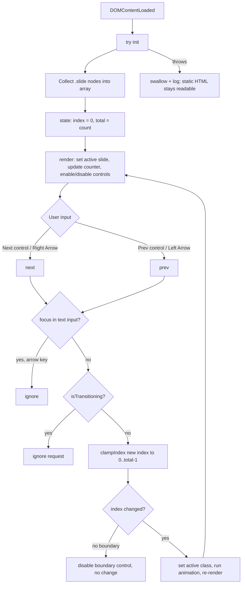

# Design Document

## Overview

This feature delivers a single standalone, browser-openable HTML training artifact:

- **`java-foundations-theory.html`** — a presenter-driven, full-screen interactive slideshow that teaches Java fundamentals to complete beginners.

The file is fully self-contained: one `.html` document with all CSS in a `<style>` block and all JavaScript in a `<script>` block, no external references, no build step, and no server. It is designed to be opened via `file://` and projected on the big screen while the presenter advances slides (Requirements 1.1–1.6).

This is the foundational entry that precedes the existing Spring Boot training series authored by Purvam Prajapati. The new deck is a **sibling of the existing `springboot-session1-theory.html`** at the workspace root and deliberately reuses that file's proven mechanics: the MacBook window chrome, the design-token theme block, the slide navigation engine (`clampIndex` / `formatCounter` / `goTo` / `render`), the slide counter, the transition + reduced-motion behavior, the code-block styling, and the `try/catch`-guarded graceful-degradation pattern.

The central design challenge is **not** algorithmic. It is twofold:

1. **Visual + behavioral consistency** with the established series file, achieved by copying its theme block and navigation engine verbatim rather than reinventing them. Because self-containment forbids a shared external stylesheet or script, consistency is maintained by duplicating a deliberately small, well-documented design-token block and the (already battle-tested) navigation script into the new file.
2. **Disciplined, beginner-appropriate content authoring** across seven topics, where the requirements explicitly cap each slide at 7 bullet points and require a single topic to be split across multiple slides when its content is large, with Java/terminal code examples present throughout.

### Design Goals

- **Zero dependencies**: no CDN, no fonts, no images that require fetching, no frameworks (Req 1.1, 1.4).
- **Open-and-run**: first slide and controls render within 3 seconds from a `file://` path, fully offline (Req 1.2, 1.4).
- **Graceful degradation**: slide text, headings, and code remain readable and selectable even if scripting fails (Req 1.5).
- **Visual cohesion** with `springboot-session1-theory.html`: identical font stack, identical color palette, identical window chrome (Req 2.1–2.4).
- **Presenter ergonomics**: keyboard + click navigation, a slide counter, an agenda tracker, animated-yet-degradable transitions (Req 3, 4, 5).
- **Beginner-appropriate density**: 3–7 bullets per content slide, topic-splitting, code snippets per topic (Req 6–14).

### Key Design Decisions

| Decision | Rationale | Requirements |
| --- | --- | --- |
| Single theory file, no lab and no shared assets | The spec defines exactly one deliverable; self-containment forbids external assets | 1.1, 1.6 |
| Copy the `THEME-SYNC` token block verbatim from `springboot-session1-theory.html` | Guarantees identical font/palette/chrome without a shared stylesheet | 2.2, 2.3, 2.4 |
| Reuse the existing slide engine (all slides in DOM, one `.active` class) | Proven, robust state model; counter total = live DOM count | 3.8, 4.3 |
| Reuse `clampIndex` + `formatCounter` pure functions verbatim | Same boundary and counter semantics as the series; directly property-testable | 3.6, 3.7, 4.1, 4.5 |
| Extend the keydown handler to ignore arrows while focus is in a text input | New requirement not present in the series file | 3.10 |
| CSS animation with `prefers-reduced-motion` + `matchMedia` feature detection | Accessibility + unsupported-animation fallback | 5.1, 5.2, 5.3 |
| `try/catch`-guarded `init()` on `DOMContentLoaded` | Static content survives any scripting failure | 1.5 |
| Datatypes presented as a bordered HTML table; code in `<pre><code>` with `white-space: pre` + `overflow-x: auto` | Meets the table and code-readability requirements with no JS | 11.2, 14.1–14.3 |

## Architecture

### File skeleton (mirrors the series file)

```
<!DOCTYPE html>
<html lang="en">
<head>
  <meta charset="utf-8">
  <meta name="viewport" ...>
  <title>Java Foundations — Theory Slideshow</title>
  <style>
    /* THEME-SYNC START  (copied byte-identically from springboot-session1-theory.html) */
    :root { /* design tokens: colors, fonts, chrome */ }
    .mac-titlebar / .traffic-light / .tl-* / .mac-title { ... }
    /* THEME-SYNC END */

    /* === FILE-SPECIFIC STYLES (theory) === */
    /* slideshow, slide, transitions, typography, tables, code blocks, nav, counter */
  </style>
</head>
<body>
  <div class="mac-window">
    <div class="mac-titlebar"> red / yellow / green dots + "...Java Foundations..." title </div>
    <div class="mac-content">
      <div class="slideshow">
        <div class="progress-rail">...</div>
        <section class="slide active"> ... </section>   <!-- all slides in DOM -->
        ...
        <button class="nav-control nav-prev">‹</button>
        <button class="nav-control nav-next">›</button>
        <div class="slide-footer"> presenter · session label </div>
        <div class="slide-counter">1 of N</div>
      </div>
    </div>
  </div>
  <script> /* clampIndex, formatCounter, slide navigator, init(), DOMContentLoaded guard */ </script>
</body>
</html>
```

### Slideshow navigation engine



The deck keeps **all slides in the DOM** at once. Exactly one slide carries the `.active` class and is visible; all others are hidden via `display: none` (Req 3.8). Navigation mutates a single integer `index` and re-applies the `active` class, so the slide-counter total is trivially equal to the live DOM slide count (Req 4.3).

### Reuse strategy vs. the series file

Because the spec requires consistency with `springboot-session1-theory.html` but also self-containment, the new file does not link to the old one. Instead:

- The `THEME-SYNC START … THEME-SYNC END` block (CSS custom properties + window-chrome rules) is **copied byte-for-byte** from the series file. A comment marks it as the synchronization point. This guarantees the identical font stack (Req 2.2) and identical palette values (Req 2.3).
- The navigation engine (`clampIndex`, `formatCounter`, `state`, `render`, `goTo`, `next`, `prev`, `init`, and the `DOMContentLoaded` guard) is reused, with one additive change: the keydown handler ignores Arrow keys when focus is inside a text input (Req 3.10).
- The window title text is changed to contain the phrase **"Java Foundations"** (Req 2.4), and the footer/cover presenter metadata is updated for this session.

### Resilience

- All script logic runs inside a single `try/catch`-guarded `init()` invoked on `DOMContentLoaded`. If initialization throws, the already-rendered static HTML (slide text, headings, code, images) remains visible and selectable; the affected control's failure is surfaced (Req 1.5).
- No `fetch`, `XMLHttpRequest`, external `<link>`, `<script src>`, `@import`, or remote `url()` is used anywhere, guaranteeing zero network requests and full offline operation (Req 1.4).
- Animation is feature-detected via `matchMedia` and disabled under `prefers-reduced-motion`, so the incoming slide appears immediately in its final position when motion is reduced or unsupported (Req 5.2, 5.3).

## Components and Interfaces

### Shared: MacBook Theme design system (copied from the series)

The theme is a block of CSS custom properties at the top of the `<style>`, copied verbatim from `springboot-session1-theory.html`.

**Color palette** (identical token values to the series file — Req 2.3):

| Token | Value | Role |
| --- | --- | --- |
| `--mac-bg` | `#ececee` | App/desktop background |
| `--mac-window` | `#ffffff` | Window body background |
| `--mac-titlebar` | `#e8e8ea` | Window title bar |
| `--mac-text` | `#1d1d1f` | Primary text |
| `--mac-text-muted` | `#6e6e73` | Secondary text |
| `--mac-accent` | `#0a84ff` | macOS system blue (accent, links, progress fill) |
| `--mac-border` | `#d2d2d7` | Hairline borders |
| `--mac-code-bg` | `#1e1e2e` | Code block background |
| `--mac-code-text` | `#f8f8f2` | Code text |
| `--tl-red` | `#ff5f57` | Traffic-light close |
| `--tl-yellow` | `#febc2e` | Traffic-light minimize |
| `--tl-green` | `#28c840` | Traffic-light zoom |

**Font stack** (identical to the series file — Req 2.2):

```css
--mac-font: -apple-system, BlinkMacSystemFont, "Segoe UI", system-ui, sans-serif;
--mac-mono: "SF Mono", ui-monospace, "Menlo", "Consolas", monospace;
```

**Window chrome component** (identical markup pattern; title text differs):

```html
<div class="mac-titlebar">
  <span class="traffic-light tl-red"></span>
  <span class="traffic-light tl-yellow"></span>
  <span class="traffic-light tl-green"></span>
  <span class="mac-title">java-foundations-theory.html — Java Foundations</span>
</div>
```

Exactly three traffic-light dots ordered red → yellow → green, enforced by source order plus a horizontal flex layout (Req 2.1). The title text contains the phrase "Java Foundations" (Req 2.4).

### Slide Navigator (reused engine)

All behavior is internal to the file's script.

| Function | Responsibility |
| --- | --- |
| `init()` | Collect slides, set `total`, render slide 0, bind click + keydown listeners |
| `clampIndex(i, total)` | Pure: returns `i` constrained to `[0, total-1]`; returns `0` when `total <= 0` |
| `goTo(i)` | If not transitioning, clamp target; if it changed, set active slide, run animation, re-render |
| `next()` / `prev()` | Call `goTo(index ± 1)` |
| `render()` | Apply `.active` to current slide, update counter text, enable/disable boundary controls, set progress rail |
| `formatCounter(current, total)` | Pure: returns `"{current} of {total}"` |

**State model:**

```
state = {
  index:           integer, 0-based current slide (0 when zero slides)
  total:           integer, count of .slide nodes
  isTransitioning: boolean, true while an animation is mid-flight
}
```

**Navigation rules:**

- Next control / Right Arrow → `next()`; Prev control / Left Arrow → `prev()` (Req 3.2–3.5). A slide change completes within 500 ms (the animation token is 350 ms).
- At the first slide, the prev control is `disabled` (persistent visual disabled indication) and a prev request leaves the slide unchanged and starts no transition (Req 3.6). At the last slide, the next control is `disabled` and a next request is a no-op (Req 3.7). The disabled state is driven by `render()` setting `navPrev.disabled = index <= 0` and `navNext.disabled = index >= total - 1`.
- If `isTransitioning` is true, any navigation request is ignored and the in-progress transition completes, leaving exactly one slide active (Req 3.9, 5.4). `isTransitioning` is set true at transition start and cleared on `animationend`, with a `setTimeout` safety net so the deck can never get stuck.
- If an Arrow key arrives while keyboard focus is within a text input (`<input>`/`<textarea>` or an editable element), the key press is ignored and the slide is unchanged (Req 3.10). Implemented by checking `document.activeElement` tag/type at the top of the keydown handler before dispatching to `next()`/`prev()`.
- Controls are absolutely positioned within the slideshow viewport and remain visible while active (Req 3.1).

**Slide counter** (Req 4):

- Rendered as `formatCounter(index + 1, total)` → e.g. `"3 of 12"`, positioned within the viewport without scrolling (Req 4.1).
- Updates on every `render()` — a synchronous text write, well within the 200 ms budget (Req 4.2).
- On load, `index = 0` → displays current `1` (Req 4.4).
- Total equals the live DOM slide count (Req 4.3). For an empty deck (`total === 0`), `render()` computes `current = 0` so the counter shows `"0 of 0"` (Req 4.5).

**Transitions** (Req 5):

- The incoming slide gets an `animating` class that triggers a CSS keyframe (fade + slight translate) beginning on the next frame (< 100 ms) and lasting `--slide-anim: 350ms` (within the 200–800 ms band) (Req 5.1).
- A `@media (prefers-reduced-motion: reduce)` block sets the animation duration to `0s`; the script also feature-detects `matchMedia` and skips the JS-driven animation, so the slide appears immediately in its final position (Req 5.2, 5.3).
- Re-entrant changes are blocked while `isTransitioning`, so a rapid sequence always settles with exactly one slide displayed (Req 5.4).

### Content structure: topic sections (Req 6–13)

The deck presents the seven topics in agenda order, with all slides for one topic appearing before the first slide of the next (Req 6.3). Each content slide carries 3–7 bullet points; when a topic needs more, it is split across multiple slides (Req 6.4, 6.5, 6.6). The content inventory is enumerated in the Data Models section.

Reusable content components (CSS classes carried over from the series file):

- `.cover` — gradient title/closing slides.
- `.agenda` — the Agenda_Tracker ordered list (Req 6.2).
- `.cards` / `.card` — feature grids (e.g., Java features, IDE benefits).
- `.flow` / `.flow-box` / `.flow-arrow` — ordered pipelines (e.g., `.java` → `javac` → `.class` → JVM) (Req 8.3).
- `.stack` / `.stack-row` — layered relationships (e.g., JDK ⊃ JRE ⊃ JVM; runtime memory areas) (Req 8.1, 8.5).
- `table.cmp` — bordered tables (the eight-primitive-types table) (Req 11.2).
- `.keybox` / `.warnbox` / `.note` — callouts for definitions and cautions (e.g., narrowing casts may lose data) (Req 11.4).
- `.checklist` — the recap list (Req 6.7).
- `.slide pre` / `.slide pre code` — code snippets (Req 14).

### Code snippet rendering (Req 14)

- Every snippet is rendered in `<pre><code>` styled with `--mac-mono`, a background (`--mac-code-bg`) that differs from the slide background, a visible four-sided border, and ≥ 8 px padding (the reused rule uses `15px 18px`) (Req 14.1).
- `<pre>` with `white-space: pre` preserves authored line breaks and leading-whitespace indentation exactly; HTML metacharacters in code are entity-escaped in source so no characters are added, removed, or substituted on render (Req 14.2).
- `overflow-x: auto` on the code block keeps long lines fully accessible via horizontal scrolling without truncation (Req 14.3).

## Data Models

These are in-memory JavaScript structures only (no persistence required by the spec).

### Slideshow state

```
SlideshowState {
  index:           number   // 0-based; 0 when total === 0
  total:           number    // === document.querySelectorAll('.slide').length
  isTransitioning: boolean
}
```

### Slide content inventory

The slide deck content is a fixed, authored sequence. The inventory below maps planned slides to the content-coverage requirements. The agenda order mirrors slide order (Req 6.2, 6.3), every content slide holds 3–7 bullets (Req 6.4, 6.6), and topics that exceed 7 bullets are split (Req 6.5). Slide counts per topic are indicative; the controlling constraint is the per-slide bullet cap, not a fixed total.

| # | Slide | Topic | Requirements |
| --- | --- | --- | --- |
| 1 | Title / cover — "Java Foundations" session of the series | — | 6.1 |
| 2 | Agenda (Agenda_Tracker, seven topics in order) | — | 6.2 |
| 3 | What is Java + origin (developer org, initial release year) | Java Fundamentals | 7.1 |
| 4 | Key features (platform independence, OO, automatic memory mgmt) | Java Fundamentals | 7.2 |
| 5 | "Write once, run anywhere" via bytecode on any JVM | Java Fundamentals | 7.3 |
| 6 | Structure of a Java program (class, `main`, statements, packages) | Java Fundamentals | 7.4 |
| 7 | Code: complete compilable program with `main` printing output | Java Fundamentals | 7.5 |
| 8 | JDK vs JRE vs JVM (contents + relationships) | JVM | 8.1 |
| 9 | Bytecode definition + role as platform-independent intermediate | JVM | 8.2 |
| 10 | Compile/execute pipeline `.java` → `javac` → `.class` → JVM | JVM | 8.3 |
| 11 | Classloading (classes loaded into memory before execution) | JVM | 8.4 |
| 12 | Runtime memory areas: heap, stack, method area (what each holds) | JVM | 8.5 |
| 13 | Garbage collection (auto reclamation of unreferenced heap objects) | JVM | 8.6 |
| 14 | JIT compilation (bytecode → native at runtime, for performance) | JVM | 8.7 |
| 15 | Code: terminal commands `javac` then `java` in order | JVM | 8.8 |
| 16 | What is an IDE + ≥ 3 benefits over a plain editor | Eclipse IDE | 9.1 |
| 17 | Eclipse as a Java IDE + ≥ 3 features (editor, build/run, debugger) | Eclipse IDE | 9.2 |
| 18 | Install the JDK — numbered steps (≥ 2) | JDK & Eclipse Setup | 10.1 |
| 19 | Verify JDK (`java -version`) + expected version string output | JDK & Eclipse Setup | 10.2 |
| 20 | Install & launch Eclipse — numbered steps (≥ 2) | JDK & Eclipse Setup | 10.3 |
| 21 | Create a Java project + class in Eclipse — numbered steps (≥ 2) | JDK & Eclipse Setup | 10.4 |
| 22 | Run a class in Eclipse + expected console output; Code snippet | JDK & Eclipse Setup | 10.5, 10.6 |
| 23 | Eight primitive types table (bits + min/max range), bordered | Datatypes | 11.1, 11.2 |
| 24 | Primitive vs reference types (objects, arrays, strings) | Datatypes | 11.3 |
| 25 | Casting/conversion: widening (implicit) vs narrowing (explicit, lossy) | Datatypes | 11.4 |
| 26 | Literals (integer, floating-point, char, boolean, string) + examples | Datatypes | 11.5 |
| 27 | Code: declare 2+ primitives; Code: a type cast | Datatypes | 11.6 |
| 28 | Declaration vs initialization | Variables | 12.1 |
| 29 | Naming rules + camelCase convention | Variables | 12.2 |
| 30 | Local vs instance vs static (declaration site + scope) | Variables | 12.3 |
| 31 | `final` for constants (cannot be reassigned) | Variables | 12.4 |
| 32 | Code: local, instance, static, and `final` variable declarations | Variables | 12.5 |
| 33 | `if` / `if`-`else` / `else`-`if` ladder / nested `if` | Conditionals | 13.1 |
| 34 | `switch` (case, break, default, fall-through) | Conditionals | 13.2 |
| 35 | Switch expressions (Java 14+, `->` form, yields a value) | Conditionals | 13.3 |
| 36 | Ternary operator (`cond ? a : b`) | Conditionals | 13.4 |
| 37 | Relational + logical operators forming conditions | Conditionals | 13.5 |
| 38 | Code: if-else-if ladder, switch, switch expression, ternary | Conditionals | 13.6 |
| 39 | Recap checklist (≥ 5 items, each referencing an earlier topic) | — | 6.7 |
| 40 | Closing — names the next session (Spring Boot Session 1) | — | 6.8 |

Topics that are bullet-dense (e.g., JVM memory areas, conditional statements) may split a single inventory row into two adjacent slides at authoring time to respect the ≤ 7 bullets cap (Req 6.5, 6.6); such splits preserve topic grouping order (Req 6.3).

### Code snippet model (logical)

```
CodeSnippet {
  text: string   // exact authored Java or terminal content, whitespace-preserving
  // rendered inside <pre><code> with --mac-mono, dark bg, border, padding, overflow-x:auto
}
```

Required snippets by topic: a complete `main` program (7.5), `javac`/`java` terminal commands (8.8), JDK verification output or first Eclipse class (10.6), primitive declarations + a cast (11.6), the four variable kinds (12.5), and conditional forms — if-else-if ladder, switch, switch expression, ternary (13.6).

## Correctness Properties

*A property is a characteristic or behavior that should hold true across all valid executions of a system — essentially, a formal statement about what the system should do. Properties serve as the bridge between human-readable specifications and machine-verifiable correctness guarantees.*

Although this deliverable is a standalone HTML file (most of whose requirements are structural/content assertions covered by example and smoke tests), it reuses a small core of **pure functions** — `clampIndex` and `formatCounter` — plus a few **state invariants** (exactly one active slide, counter in range, boundary no-ops, navigation ignored mid-transition) and a **text-fidelity** guarantee for code snippets. These are genuinely input-varying and are the right targets for property-based testing. The structural requirements (theme equality, traffic-light order, topic coverage, table shape, code-block styling) are covered by the example and smoke tests in the Testing Strategy instead.

The pure functions are written so they can be tested in isolation (extracted into a tiny module or duplicated verbatim into a test harness) without a DOM, while the invariants are exercised against a lightweight in-memory model of the slideshow state driven by randomized navigation sequences.

### Property 1: Clamp stays in range

*For any* integer `i` and any `total >= 0`, `clampIndex(i, total)` returns `0` when `total === 0`, and otherwise returns an index within `[0, total - 1]`; in particular `clampIndex(-1, total) === 0` and `clampIndex(total, total) === total - 1`. This guarantees a previous request at the first slide and a next request at the last slide cannot move outside the deck.

**Validates: Requirements 3.6, 3.7**

### Property 2: Navigation invariant — exactly one active slide, counter in range

*For any* non-empty deck of `total` slides and *any* finite sequence of next/prev navigation requests, after the sequence is applied exactly one slide carries the `active` class and the current slide number (`index + 1`) is an integer in `[1, total]`. Repeated prev at the first slide keeps the slide unchanged, and repeated next at the last slide keeps the slide unchanged.

**Validates: Requirements 3.2, 3.3, 3.4, 3.5, 3.8, 4.2**

### Property 3: Navigation during a transition is ignored

*For any* deck and *any* sequence of navigation requests in which some requests arrive while `isTransitioning` is true, every request received during an in-progress transition leaves `index` unchanged, and the single-active-slide invariant continues to hold throughout — so a rapid sequence always settles with exactly one slide displayed.

**Validates: Requirements 3.9, 5.4**

### Property 4: Counter correctness

*For any* `current` and `total`, `formatCounter(current, total)` produces exactly the string `"{current} of {total}"`; for a non-empty deck the displayed total equals the live count of `.slide` nodes, and for an empty deck (`total === 0`) the counter shows `"0 of 0"`.

**Validates: Requirements 4.1, 4.3, 4.5**

### Property 5: Snippet text fidelity

*For any* authored snippet string (including arbitrary line breaks and leading/trailing whitespace), the text captured from the rendered `<code>` element (`textContent`) is byte-for-byte equal to the authored content, preserving all characters, newlines, and indentation with nothing added, removed, or substituted.

**Validates: Requirements 14.2**

## Error Handling

Because the artifact runs with no server, no network, and no framework, error handling centers on **degrading gracefully** so that the static content a presenter needs is never lost.

| Scenario | Trigger | Handling | Requirement |
| --- | --- | --- | --- |
| Initialization failure | An inline script throws during `init()` | All script logic runs inside a single `try/catch` invoked on `DOMContentLoaded`. On throw, the error is logged to the console and the already-rendered static HTML — slide text, headings, code snippets, images — remains visible and selectable. The affected control's inability to respond is the surfaced failure indication. No interactive feature is allowed to block static rendering. | 1.5 |
| Reduced-motion / unsupported animation | `prefers-reduced-motion: reduce`, or `matchMedia`/CSS animation unsupported | A media-query block sets the animation duration to `0s`; the script feature-detects `matchMedia` and skips the JS-driven animation. The incoming slide appears immediately in its final position, fully legible. | 5.2, 5.3 |
| Re-entrant navigation during a transition | A next/prev request (click or arrow) arrives while `isTransitioning` is true | `goTo()` returns early without changing `index`; the in-progress animation finishes via `animationend`, and a `setTimeout` safety net clears `isTransitioning` so the deck can never get stuck. Exactly one slide remains displayed. | 3.9, 5.4 |
| Arrow key inside a text input | Right/Left Arrow pressed while `document.activeElement` is an `<input>`/`<textarea>`/editable | The keydown handler checks the active element first and returns without navigating, leaving the slide unchanged. | 3.10 |
| Boundary navigation | Prev at the first slide / Next at the last slide | The boundary control is rendered `disabled` (persistent visual indication), and `clampIndex` makes the request a no-op that starts no transition. | 3.6, 3.7 |
| Zero slides | Deck contains no `.slide` nodes | `clampIndex` returns `0`, state `index = 0`, and `render()` computes `current = 0`, so the counter renders `"0 of 0"` rather than throwing or showing a negative/NaN value. Navigation requests are no-ops. | 4.5 |

General principles:

- **Static-first**: every interactive enhancement is additive. If it fails, the underlying HTML still conveys the full content (Req 1.5).
- **Defensive feature detection** for `matchMedia` and `animationend`, with a timeout safety net that clears `isTransitioning`.
- **No network, ever**: no `fetch`/`XHR`/external resource means there are no network-failure paths to handle (Req 1.4).

## Testing Strategy

The artifact is a standalone HTML file opened via `file://` with no network, so the strategy combines **manual browser verification**, **static/textual checks**, **example-based DOM assertions**, and **property-based testing of the small pure-logic core**.

### Manual / environment verification

- Open the file directly via a `file://` path in a modern browser (HTML5/CSS3/ES6) and confirm the first slide and controls render within 3 seconds and all controls work without a server (Req 1.2).
- With the network tab open and/or while offline, confirm **zero** outbound requests are made and navigation still works (Req 1.4).
- Spot-check timing-sensitive behaviors that are impractical to property-test: slide change completes < 500 ms (Req 3.2–3.5), transition begins < 100 ms and lasts 200–800 ms (Req 5.1), reduced-motion immediate placement (Req 5.2).

### Static and textual checks (smoke)

- **Self-containment scan**: grep the file for `<link`, `<script src`, `@import`, `fetch`, `XMLHttpRequest`, and remote `url(...)`; assert none are present (Req 1.1, 1.4).
- **Workspace-root location**: assert the file exists at the workspace root alongside the series files (Req 1.6).
- **THEME-SYNC equality check**: extract the text between `/* THEME-SYNC START */` and `/* THEME-SYNC END */` from `java-foundations-theory.html` and `springboot-session1-theory.html`; assert the two blocks are **byte-identical**. This is the guard that the font stack (Req 2.2) and palette values — `--mac-bg`, `--mac-text`, `--mac-accent` (Req 2.3) — match the series file. This is a single deterministic string comparison, not a property test.

### Example-based DOM assertions

These cover the fixed, authored structure and content (parse the HTML, query the DOM, assert):

- Exactly three traffic-light elements in source order red → yellow → green (Req 2.1); the `.mac-title` text contains "Java Foundations" (Req 2.4); nav controls are absolutely positioned in the viewport (Req 3.1).
- On load with ≥ 1 slide, the counter shows current `1` (Req 4.4); animation duration token is within 200–800 ms (Req 5.1); reduced-motion / unsupported-animation fallbacks place the slide immediately (Req 5.2, 5.3); arrow keys inside a text input are ignored (Req 3.10, edge case).
- Deck structure: a cover slide identifies the Java Foundations session (Req 6.1); the agenda lists the seven topics in slide order (Req 6.2); topic slides are contiguous and ordered (Req 6.3); every content slide has 3–7 bullets and no slide exceeds 7 (Req 6.4, 6.5, 6.6); a recap slide has ≥ 5 items referencing earlier topics (Req 6.7); a closing slide names Spring Boot Session 1 (Req 6.8).
- Topic content assertions: Java Fundamentals (Req 7.1–7.5), JVM (Req 8.1–8.8, including pipeline order and `javac`-before-`java` in the snippet), Eclipse IDE ≥ 3 benefits and ≥ 3 features (Req 9.1, 9.2), setup numbered steps and snippet (Req 10.1–10.6), datatypes incl. the eight-row bordered table with ≥ 3 columns (Req 11.1–11.6), variables incl. the four-kinds snippet (Req 12.1–12.5), conditionals incl. the four required snippets (Req 13.1–13.6).
- Code blocks use the monospace token, a background distinct from the slide, a four-sided border, ≥ 8 px padding, `white-space: pre`, and `overflow-x: auto` (Req 14.1, 14.3).

### Property-based testing of pure functions and invariants

Use an established property-based testing library for the target language (for browser JS, **fast-check**); do **not** hand-roll the generator/shrinking engine. Each property test:

- runs a **minimum of 100 iterations**, and
- is tagged with a comment referencing its design property in the format **Feature: java-foundations-theory-materials, Property {number}: {property_text}**.

The pure functions (`clampIndex`, `formatCounter`) are tested in isolation — extracted into a small testable module or duplicated verbatim into the test harness — so no DOM is required. The stateful invariants (Properties 2 and 3) are exercised against a lightweight in-memory model of the slideshow state driven by randomized next/prev request sequences. Property 5 (snippet fidelity) is exercised by rendering randomized snippet strings into a `<pre><code>` (entity-escaped) via a `jsdom`-style DOM and asserting `textContent` round-trips.

| Design property | Generators | What is asserted |
| --- | --- | --- |
| Property 1 — Clamp range | random `i`, `total >= 0` (incl. `0`, boundaries) | result `0` when empty, else in `[0, total-1]`; `clampIndex(-1,t)=0`, `clampIndex(t,t)=t-1` |
| Property 2 — Navigation invariant | random `total > 0`, random next/prev sequence | exactly one active slide; current in `[1, total]`; boundary requests no-op |
| Property 3 — Ignore during transition | random sequence with requests while `isTransitioning` | `index` unchanged for in-transition requests; one-active invariant holds; settles with one slide |
| Property 4 — Counter correctness | random `current`, `total` (incl. `0`) | exact `"{current} of {total}"`; total == slide count; `"0 of 0"` when empty |
| Property 5 — Snippet fidelity | random strings with newlines + leading/trailing whitespace | extracted `textContent` byte-for-byte equals authored snippet |

### Dual testing rationale

Example and smoke tests pin down the fixed structure, theme consistency, and authored content (the bulk of the requirements). Property tests verify the universal behavior of the reused navigation/counter logic and the code-snippet fidelity guarantee across many inputs, catching boundary and re-entrancy bugs that fixed examples would miss. Together they give comprehensive coverage appropriate to a content-heavy, logic-light artifact.
