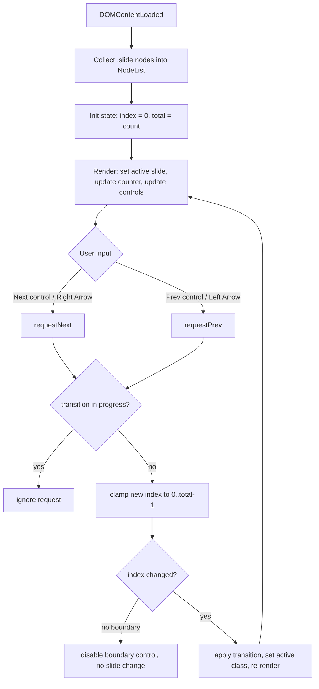
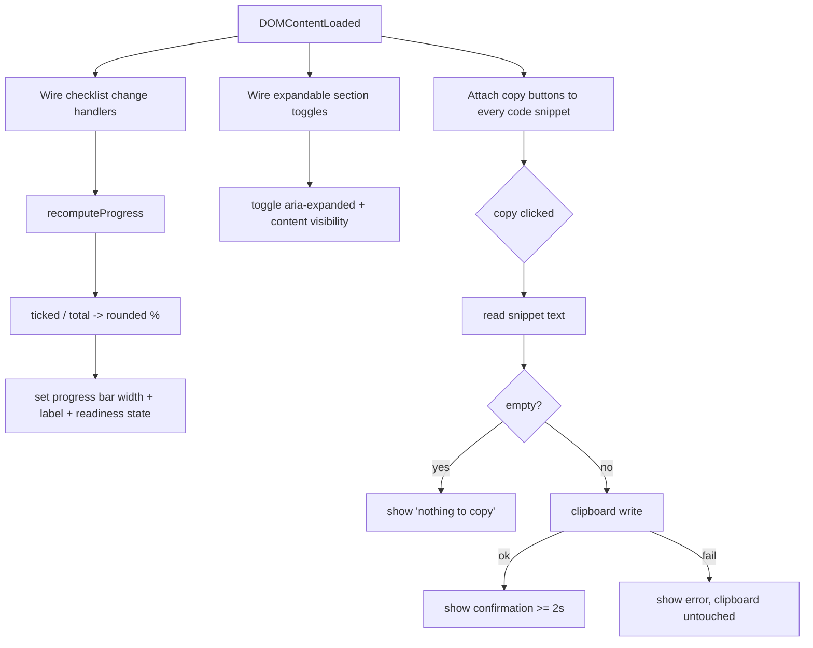

# Design Document

## Overview

This feature delivers two standalone, browser-openable HTML training artifacts for a Spring Boot "Session 1" training:

1. **`springboot-session1-theory.html`** — a presenter-driven interactive slideshow of 30–40 slides.
2. **`springboot-session1-lab.html`** — a single scrollable hands-on lab manual.

Both files are fully self-contained: a single `.html` document each, with all CSS in a `<style>` block and all JavaScript in a `<script>` block, no external references, no build step, and no server. They are designed to be opened via `file://` and run simultaneously and independently (Requirements 1.1–1.6).

The central design challenge is not algorithmic complexity but **disciplined construction of two artifacts that share a visual identity (the MacBook theme) while having fundamentally different interaction models** — one is a stateful, one-slide-at-a-time deck; the other is a free-scrolling document with local widget state. Because there is no shared module system (the files cannot import a common stylesheet without violating the self-containment requirement), consistency is maintained by duplicating a deliberately small, well-documented design-token block into both files.

### Design Goals

- **Zero dependencies**: no CDN, no fonts, no images that require fetching, no frameworks (Req 1.1, 1.2, 1.4).
- **Graceful degradation**: static content remains readable even if scripting fails or features are unsupported (Req 1.5, 6.4, 6.5, 10.4).
- **Visual cohesion**: a single source-of-truth token set, copied verbatim into both files (Req 2.3, 2.4).
- **Presenter ergonomics** for the slideshow (keyboard + click navigation, counter, agenda) (Req 3, 4, 5).
- **Associate ergonomics** for the lab (sticky progress, expandable sections, copy buttons) (Req 7–11, 17).

### Key Design Decisions

| Decision | Rationale | Requirements |
| --- | --- | --- |
| Two separate files, no shared assets | Self-containment + simultaneous independent use | 1.1, 1.2, 1.6 |
| CSS custom properties (`:root` variables) for all theme tokens | Single edit point per file; documented "theme block" copied identically into both | 2.3, 2.4 |
| Slideshow = all slides in DOM, visibility toggled by an `active` class | Simple, robust state model; counter total = DOM count | 3.8, 4.3 |
| Lab = plain document flow, `<details>`-style expandable sections | Native collapse semantics, scroll-friendly, no slide engine | 7.1, 7.3, 9 |
| `navigator.clipboard` with `execCommand` fallback | `file://` clipboard reliability across browsers | 10.2, 10.4 |
| `prefers-reduced-motion` media query drives transition behavior | Accessibility + Req 6.4 fallback | 6.2, 6.4 |
| CSS-only architecture diagram (boxes + connectors) with `<noscript>`/text fallback | No image dependency; render-failure resilience | 6.1, 6.5 |

## Architecture

### Shared structure of both files

Each file follows the same top-level skeleton so that the theme block and window chrome are introduced identically:

```
<!DOCTYPE html>
<html lang="en">
<head>
  <meta charset="utf-8">
  <meta name="viewport" ...>
  <title>...</title>
  <style>
    /* === THEME BLOCK (identical in both files) === */
    :root { /* design tokens: colors, fonts, chrome */ }
    /* === FILE-SPECIFIC STYLES === */
  </style>
</head>
<body>
  <!-- MacBook window chrome (traffic lights + title bar) -->
  <!-- File-specific content -->
  <script>
    /* file-specific behavior, wrapped defensively */
  </script>
</body>
</html>
```

### Theory Slideshow architecture



The slideshow keeps **all slides in the DOM** at once. Exactly one slide carries the `.active` class and is visible; all others are hidden via CSS (Req 3.8, 8 slides-at-a-time → exactly one). Navigation mutates a single integer `index` and re-applies the `active` class. This makes the slide-counter total trivially equal to the live DOM slide count (Req 4.3).

### Lab Sheet architecture



The lab sheet is a normal scrolling document. The only persistent state is the **set of checked checklist items**, which drives the progress bar. Expandable sections and copy buttons hold purely local, transient state.

### Independence and resilience

- The two files share no runtime, no storage keys that collide, and no global state. Opening both produces no cross-talk (Req 1.6). (If persistence is added it uses file-specific `localStorage` keys, e.g. `sb-s1-lab-*`, but the baseline design does not require persistence.)
- All script logic runs inside a single `try/catch`-guarded `init()` invoked on `DOMContentLoaded`. If initialization throws, the static HTML (slides, lab text, code) remains rendered and readable (Req 1.5).
- No `fetch`, `XMLHttpRequest`, external `<link>`, `<script src>`, `@import`, or remote `url()` is used anywhere, guaranteeing zero network requests (Req 1.4).

## Components and Interfaces

### Shared: MacBook Theme design system

The theme is expressed as a block of CSS custom properties placed at the top of each file's `<style>`. This exact block is **copied verbatim** into both files; a comment marks it as the synchronization point.

**Color palette** (macOS-inspired):

| Token | Value | Role |
| --- | --- | --- |
| `--mac-bg` | `#ececee` | App/desktop background |
| `--mac-window` | `#ffffff` | Window body background |
| `--mac-titlebar` | `#e8e8ea` (light) | Window title bar |
| `--mac-text` | `#1d1d1f` | Primary text |
| `--mac-text-muted` | `#6e6e73` | Secondary text |
| `--mac-accent` | `#0a84ff` | macOS system blue (accent, links, progress fill) |
| `--mac-border` | `#d2d2d7` | Hairline borders |
| `--mac-code-bg` | `#1e1e2e` | Code block background |
| `--mac-code-text` | `#f8f8f2` | Code text |
| `--tl-red` | `#ff5f57` | Traffic-light close |
| `--tl-yellow` | `#febc2e` | Traffic-light minimize |
| `--tl-green` | `#28c840` | Traffic-light zoom |

**Font stack** (system fonts only, no downloads):

```css
--mac-font: -apple-system, BlinkMacSystemFont, "Segoe UI", system-ui, sans-serif;
--mac-mono: "SF Mono", ui-monospace, "Menlo", "Consolas", monospace;
```

The identical `--mac-font` is the primary family in both files (Req 2.3); equivalent elements use the identical token values (Req 2.4).

**Window chrome component** (identical markup in both files):

```html
<div class="mac-titlebar">
  <span class="traffic-light tl-red"></span>
  <span class="traffic-light tl-yellow"></span>
  <span class="traffic-light tl-green"></span>
  <span class="mac-title">springboot-session1 — ...</span>
</div>
```

Exactly three traffic-light dots ordered red → yellow → green, left to right (Req 2.1, 2.2). The order is enforced by source order plus a horizontal flex layout (not by floats), so it is stable regardless of width.

**Consistency strategy across two files:** Because self-containment forbids a shared external stylesheet, the theme block is duplicated. To keep the duplication safe:
- The block is fenced by `/* THEME-SYNC START */` … `/* THEME-SYNC END */` comments in both files.
- A note in the testing strategy describes a textual equality check between the two fenced blocks (and the chrome markup) so drift is caught.

### Theory Slideshow: Slide Navigator

Public behavior (all internal to the file's script):

| Function | Responsibility |
| --- | --- |
| `init()` | Collect slides, set `total`, render slide 0, bind listeners |
| `clampIndex(i, total)` | Pure: returns `i` constrained to `[0, total-1]`; for `total === 0` returns `0` |
| `goTo(i)` | If not transitioning and `i` is a valid in-range neighbor, set active slide, run transition, re-render |
| `next()` / `prev()` | Compute target index via `clampIndex(index ± 1, total)` and call `goTo` |
| `render()` | Apply `.active` to current slide, update counter text, enable/disable boundary controls |
| `formatCounter(current, total)` | Pure: returns `"{current} of {total}"` (Req 4.1 format) |

**State model:**

```
state = {
  index:           integer, 0-based current slide (0 when zero slides)
  total:           integer, count of .slide nodes
  isTransitioning: boolean, true while an animation is mid-flight
}
```

**Navigation rules:**
- Right Arrow / next control → `next()`; Left Arrow / prev control → `prev()` (Req 3.2–3.5).
- At the first slide, the prev control is disabled and a prev request leaves the slide unchanged (Req 3.6). At the last slide, the next control is disabled and a next request leaves the slide unchanged (Req 3.7).
- If `isTransitioning` is true, any navigation request is ignored and the in-progress transition completes, leaving exactly one slide active (Req 3.9). `isTransitioning` is set true at transition start and cleared on `transitionend` (with a timeout safety net).
- Controls (prev/next) are absolutely positioned within the slideshow viewport and remain visible while active (Req 3.1).

**Slide counter** (Req 4):
- Rendered as `formatCounter(index+1, total)` → e.g. `"3 of 12"`.
- Updates on every render, well within 200 ms since it is a synchronous text write (Req 4.2).
- On load, `index = 0` → displays current `1` (Req 4.4).
- Total equals live DOM slide count (Req 4.3). If zero slides, displays `0 of 0` and `index` reports current as `0` (Req 4.5) — handled by `formatCounter` treating empty decks specially.

**Transitions** (Req 6.2, 6.4):
- Incoming slide animates (fade + slight translate) via CSS class toggling; the animation begins within 100 ms (next frame) and lasts 200–800 ms (token `--slide-anim: 350ms`).
- A `@media (prefers-reduced-motion: reduce)` block sets transition duration to `0s`, so the incoming slide appears immediately in final position (Req 6.4). The script also feature-detects `matchMedia` and skips JS-driven animation accordingly.

### Theory Slideshow: Architecture diagram (Req 6.1, 6.5)

Rendered with **pure HTML/CSS**: each of the 7 elements (Browser, HTTP Request, DispatcherServlet, Controller, Service, Repository, Database) is a bordered box (`.arch-node`) with a text label, laid out in a flow row/column, connected by CSS connector elements (`.arch-arrow`) rendered with borders/`::after` triangles (Req 6.1 — distinct shapes + labels + connecting lines, not prose).

**Render-failure fallback (Req 6.5):** The diagram slide also contains a visually-hidden-by-default text fallback (`.arch-fallback`) listing the same flow as text. The init routine wraps diagram setup in `try/catch`; on failure (or if a sentinel check finds the diagram container missing/zero-size), it adds a class that reveals the fallback ("Architecture diagram unavailable — request flow: Browser → … → Database") and keeps the rest of the slide's text intact.

### Lab Sheet: Section layout (Req 7)

Single scrolling page, seven sections in fixed top-to-bottom order, each with a distinct heading (Req 7.4, 7.5):

1. Header with checklist + sticky progress bar
2. Pre-requisites check
3. Lab 1
4. Lab 2
5. Lab 3
6. Lab 4
7. Quick reference card

No slide engine, no per-slide navigation control exists (Req 7.3). Content flows in normal document order so scrolling reaches any section (Req 7.1, 7.2).

### Lab Sheet: Progress tracker (Req 8)

| Function | Responsibility |
| --- | --- |
| `computeProgress(ticked, total)` | Pure: returns `total === 0 ? 0 : round(ticked / total * 100)` |
| `recomputeProgress()` | Counts checked items, calls `computeProgress`, sets bar width + label, toggles readiness message |

- The progress bar lives in the header and is pinned via `position: sticky; top: 0` so it never scrolls out of view (Req 8.1, 8.2).
- Each lab step + each prerequisite is a tickable `Checklist_Item` (Req 8.3, 11.2).
- On any tick/untick, the bar width is set to `computeProgress(...)%` (Req 8.4, 8.5). All ticked → 100% (Req 8.6); load with none ticked → 0% (Req 8.7).
- When the four prerequisite items are all checked, a "machine ready" indication is shown (Req 11.4).

### Lab Sheet: Expandable sections (Req 9)

- Implemented with native `<details>`/`<summary>` (or an equivalent button + `aria-expanded` + collapsible panel). The disclosure triangle / chevron is the collapsed-vs-expanded indicator (Req 9.1).
- Toggling reveals/hides within 500 ms via a CSS height/opacity transition and flips the indicator (Req 9.2, 9.3).
- Each section toggles independently; activating one leaves others unchanged — guaranteed because each `<details>` holds its own `open` state (Req 9.4).

### Lab Sheet: Copy buttons (Req 10)

| Function | Responsibility |
| --- | --- |
| `getSnippetText(el)` | Pure read of the snippet's exact text (preserving whitespace/newlines) |
| `copySnippet(text)` | Attempts `navigator.clipboard.writeText`; on rejection/absence, falls back to a hidden `<textarea>` + `document.execCommand('copy')`; returns success/failure |
| `attachCopyButtons()` | Inserts exactly one button per code snippet and wires the click handler with empty/success/failure UX |

- Exactly one button per snippet (Req 10.1).
- Copied text preserves all characters, line breaks, and leading/trailing whitespace — taken from `textContent` of the `<code>` element, not re-rendered HTML (Req 10.2, 17.3).
- Success → confirmation shown within 500 ms, visible ≥ 2 s (Req 10.3).
- Failure → error indication, prior clipboard untouched (we never clear the clipboard before a confirmed write) (Req 10.4).
- Empty snippet → "nothing to copy" indication, no clipboard write attempted, clipboard untouched (Req 10.5).

**`file://` clipboard consideration:** `navigator.clipboard` requires a secure context; `file://` is treated as secure in most modern browsers, but some block it or require a user gesture. The copy always runs inside the click handler (a user gesture) and falls back to `execCommand('copy')` (which works from `file://`) if the async API is unavailable or rejects. If both fail, the failure path (Req 10.4) fires.

### Code snippet rendering (Req 17, shared)

- Both files render code in `<pre><code>` with `--mac-mono`, `--mac-code-bg`, a border, and padding — visually distinct from surrounding content (Req 17.1, 17.2).
- `<pre>` with `white-space: pre` preserves authored line breaks and leading-whitespace indentation exactly (Req 17.3).
- `overflow-x: auto` on the code block keeps long lines fully accessible via horizontal scrolling without truncation (Req 17.4).

## Data Models

These are in-memory JavaScript structures only (no persistence required by the spec).

### Slideshow state

```
SlideshowState {
  index:           number   // 0-based; 0 when total === 0
  total:           number    // === document.querySelectorAll('.slide').length
  isTransitioning: boolean
}
```

### Lab checklist model

```
ChecklistModel {
  items: ChecklistItem[]      // prerequisites + lab steps
}

ChecklistItem {
  id:      string             // unique, stable
  label:   string
  checked: boolean
}

ProgressView {
  percent:    number          // computeProgress(tickedCount, items.length), 0..100 integer
  ready:      boolean         // true when all prerequisite items checked
}
```

### Code snippet model (logical)

```
CodeSnippet {
  text: string                // exact authored content, whitespace-preserving
  // rendered inside <pre><code>, with one Copy_Button attached
}
```

### Content inventory model

The slide deck content is a fixed, authored sequence. The inventory below maps planned slides to the content-coverage requirements (Req 5); the deck total is held to 30–40 (Req 5.1) and the agenda order mirrors slide order (Req 5.3).

| # | Slide | Requirement |
| --- | --- | --- |
| 1 | Title / cover — "Spring Boot Session 1" | 5.2 |
| 2 | Agenda (Agenda_Tracker, ordered topics) | 5.3 |
| 3–5 | Traditional Spring problems: XML config, manual wiring, no embedded server | 5.4 |
| 6–8 | What is Spring Boot: convention over config, auto-config, embedded server, starters, production-ready | 5.5 |
| 9 | Spring vs Spring Boot comparison table (≥3 attributes) | 5.6, 6.3 |
| 10 | Architecture diagram (7-element request flow) | 5.7, 6.1 |
| 11–15 | Feature deep dives: auto-config, embedded server, starters, opinionated defaults, Actuator | 5.8 |
| 16 | Common starters table (≥5 starters) | 5.9, 6.3 |
| 17–18 | `@SpringBootApplication` decomposed into `@Configuration`, `@EnableAutoConfiguration`, `@ComponentScan` | 5.10 |
| 19–22 | Dependency injection: tight vs loose coupling, `@Component`, `@Autowired`, IoC container | 5.11 |
| 23 | Spring Initializr walkthrough | 5.12 |
| 24 | Project structure deep dive | 5.13 |
| 25 | `pom.xml` anatomy | 5.14 |
| 26 | `application.properties` | 5.15 |
| 27+ | Additional split slides where a topic exceeds 7 bullets | 5.18 |
| n-2 | Session 2 preview | 5.16 |
| n-1 | Recap checklist (≥5 items, each referencing earlier topic) | 5.17 |
| n | Closing / thank-you | — |

The lab content inventory maps to Req 11–16 (prerequisites, Labs 1–4, quick reference) as laid out in the section layout above and detailed per-lab in the requirements.

## Correctness Properties

*A property is a characteristic or behavior that should hold true across all valid executions of a system — essentially, a formal statement about what the system should do. Properties serve as the bridge between human-readable specifications and machine-verifiable correctness guarantees.*

Although both deliverables are standalone HTML files (which would normally lean on snapshot/example tests), they contain a small core of **pure functions** — `clampIndex`, `formatCounter`, `computeProgress`, `getSnippetText` — plus a few **state invariants** (exactly one active slide, one copy button per snippet, independent expandable sections). These are genuinely input-varying and are the right targets for property-based testing. The structural/content requirements (theme markup, slide inventory, lab text) are covered by example and smoke tests in the Testing Strategy instead.

The pure functions are written so they can be tested in isolation (e.g. extracted into a tiny shared module or duplicated verbatim into a test harness) without a DOM, while the invariants are exercised against a lightweight in-memory model of the slideshow/lab state.

### Property 1: Clamp stays in range

*For any* integer `i` and any `total >= 0`, `clampIndex(i, total)` returns an index that is `0` when `total === 0`, and otherwise lies within `[0, total - 1]`; in particular `clampIndex(-1, total) === 0` and `clampIndex(total, total) === total - 1`.

**Validates: Requirements 3.6, 3.7**

### Property 2: Navigation invariant — exactly one active slide, counter in range

*For any* non-empty deck of `total` slides and *any* finite sequence of next/prev navigation requests, after the sequence is applied exactly one slide carries the `active` class and the current slide number (`index + 1`) is an integer in `[1, total]`. Repeated prev at the first slide keeps the slide unchanged, and repeated next at the last slide keeps the slide unchanged.

**Validates: Requirements 3.2, 3.3, 3.4, 3.5, 3.8, 4.2**

### Property 3: Navigation during a transition is ignored

*For any* deck and *any* sequence of navigation requests in which some requests arrive while `isTransitioning` is true, every request received during an in-progress transition leaves `index` unchanged, and the single-active-slide invariant continues to hold throughout.

**Validates: Requirements 3.9**

### Property 4: Counter correctness

*For any* `current` and `total`, `formatCounter` produces exactly the string `"{current} of {total}"`; for a non-empty deck the displayed total equals the live count of `.slide` nodes, and for an empty deck (`total === 0`) the counter shows `"0 of 0"`.

**Validates: Requirements 4.1, 4.3, 4.5**

### Property 5: Progress is the rounded ticked ratio

*For any* `total >= 0` and *any* `ticked` with `0 <= ticked <= total`, `computeProgress(ticked, total)` equals `0` when `total === 0`, otherwise equals `Math.round(ticked / total * 100)`, and is always an integer in `[0, 100]`; in particular it equals `0` when `ticked === 0` and `100` when `ticked === total`.

**Validates: Requirements 8.4, 8.5, 8.6, 8.7**

### Property 6: Exactly one copy button per snippet

*For any* collection of code snippets rendered into the lab, `attachCopyButtons()` results in exactly one Copy_Button associated with each snippet — the number of copy buttons equals the number of snippets and no snippet has zero or more than one button.

**Validates: Requirements 10.1**

### Property 7: Snippet text fidelity

*For any* authored snippet string (including arbitrary line breaks and leading/trailing whitespace), the text captured by `getSnippetText` for copying is byte-for-byte equal to the authored content, preserving all characters, newlines, and indentation.

**Validates: Requirements 10.2, 17.3**

### Property 8: Expandable sections toggle independently

*For any* set of Expandable_Sections and *any* sequence of toggle activations, each toggle changes only the open/collapsed state (and the matching visual indicator) of its own section, leaving the state of every other section unchanged.

**Validates: Requirements 9.4**

## Error Handling

Because both artifacts run with no server, no network, and no framework, error handling centers on **degrading gracefully** so that the static content a presenter or associate needs is never lost.

| Scenario | Trigger | Handling | Requirement |
| --- | --- | --- | --- |
| Initialization failure | An inline script throws during `init()` | All script logic runs inside a single `try/catch` invoked on `DOMContentLoaded`. On throw, the error is swallowed (optionally logged to console) and the already-rendered static HTML — slides, lab text, code snippets — remains readable. No interactive feature is allowed to block static rendering. | 1.5 |
| Clipboard write failure | `navigator.clipboard.writeText` rejects/absent and `execCommand('copy')` fallback also fails | `copySnippet` returns failure; the UI shows a visible error indication within 500 ms. The clipboard is never cleared or written before a confirmed success, so prior clipboard contents stay untouched. | 10.4 |
| Empty snippet copy | Copy_Button activated for a snippet whose `getSnippetText` is zero-length | Short-circuit before any clipboard call: show a "nothing to copy" indication and make no write attempt, leaving the clipboard unchanged. | 10.5 |
| Architecture diagram render failure | Diagram container missing/zero-size, or diagram setup throws | Diagram setup is wrapped in `try/catch` with a sentinel size check. On failure a class is added that reveals the `.arch-fallback` text ("Architecture diagram unavailable — request flow: Browser → … → Database"); the rest of the slide's text content is preserved. | 6.5 |
| Reduced-motion / unsupported animation | `prefers-reduced-motion: reduce`, or `matchMedia`/transitions unsupported | A media-query block sets transition duration to `0s`; the script feature-detects `matchMedia` and skips JS-driven animation. The incoming slide appears immediately in its final position. | 6.4 |
| Zero slides | Deck contains no `.slide` nodes | `clampIndex` returns `0`, state `index = 0`, and `formatCounter` renders `"0 of 0"` rather than throwing or showing a negative/NaN counter. Navigation requests are no-ops. | 4.5 |

General principles:
- **Static-first**: every interactive enhancement is additive. If it fails, the underlying HTML still conveys the full content.
- **No destructive-before-confirmed**: clipboard and other side effects only commit after the operation is known to succeed.
- **Defensive feature detection** for `navigator.clipboard`, `matchMedia`, and `transitionend` (with a timeout safety net that clears `isTransitioning` so the deck can never get stuck).

## Testing Strategy

Both artifacts are standalone HTML files opened via `file://` with no network, so the strategy combines **manual browser verification**, **static/textual checks**, **example-based DOM assertions**, and **property-based testing of the pure logic**.

### Manual / environment verification

- Open each file directly via a `file://` path in a modern browser (HTML5/CSS3/ES6) and confirm full content renders and controls work without a server (Req 1.3).
- Verify with the network tab open and/or while offline that **zero** outbound requests are made (Req 1.4).
- Open both files simultaneously in separate windows; interact with one and confirm the other's displayed state is unaffected (Req 1.6).
- Spot-check timing-sensitive behaviors that are impractical to property-test: transition start < 100 ms and duration 200–800 ms (Req 6.2), copy confirmation visible ≥ 2 s (Req 10.3), reduced-motion immediate placement (Req 6.4).

### Static and textual checks (smoke)

- **Self-containment scan**: grep each file for `<link`, `<script src`, `@import`, `fetch`, `XMLHttpRequest`, and remote `url(...)`; assert none are present (Req 1.1, 1.2, 1.4).
- **THEME-SYNC equality check**: extract the text between `/* THEME-SYNC START */` and `/* THEME-SYNC END */` from both files and assert the two blocks are **byte-identical**. Also compare the window-chrome markup. This is the guard against theme drift between the duplicated token blocks (Req 2.3, 2.4). This is a single deterministic string comparison, not a property test.

### Example-based DOM assertions

These cover the fixed, authored structure and content (parse the HTML, query the DOM, assert):

- Exactly three traffic-light elements in source order red → yellow → green in each file (Req 2.1, 2.2).
- Slide count is in `[30, 40]`; required slides exist (title, agenda, traditional-Spring problems, Spring Boot definition, comparison table, architecture diagram, feature deep-dives, starters table, `@SpringBootApplication` decomposition, DI, Initializr, project structure, `pom.xml`, `application.properties`, Session 2 preview, recap ≥ 5 items) (Req 5.*).
- Architecture diagram has 7 labeled node shapes plus connector elements (Req 6.1); comparison and starter tables have a header row, ≥ 2 columns, visible borders, and the required row counts (Req 6.3, 5.6, 5.9).
- Lab has the seven sections in the required top-to-bottom order with distinct headings and no slide-navigation control (Req 7.*); progress bar is `position: sticky` in the header (Req 8.1, 8.2); four prerequisite items each have a verification step and readiness shows only when all four are checked (Req 11.*).
- Lab content assertions for Labs 1–4 and the quick reference card (Req 12–16).
- Code blocks use the monospace token, a distinct bordered/padded container, `white-space: pre`, and `overflow-x: auto` (Req 17.1, 17.2, 17.4).

### Property-based testing of pure functions and invariants

Use an established property-based testing library for the target language (for browser JS, **fast-check**); do **not** hand-roll the generator/shrinking engine. Each property test:
- runs a **minimum of 100 iterations**,
- is tagged with a comment referencing its design property in the format **Feature: springboot-session1-training-materials, Property {number}: {property_text}**.

The pure functions (`clampIndex`, `formatCounter`, `computeProgress`, `getSnippetText`) are tested in isolation — extracted into a small testable module (or duplicated verbatim into the test harness) so no DOM is required. The stateful invariants (Properties 2, 3, 6, 8) are exercised against a lightweight in-memory model of slideshow/lab state driven by randomized request/toggle sequences; a `jsdom`-style DOM or the model directly is used to assert the active-slide and button-count invariants.

| Design property | Generators | What is asserted |
| --- | --- | --- |
| Property 1 — Clamp range | random `i`, `total >= 0` (incl. `0`, boundaries) | result `0` when empty, else in `[0, total-1]` |
| Property 2 — Navigation invariant | random `total > 0`, random next/prev sequence | exactly one active slide; current in `[1, total]`; boundary requests no-op |
| Property 3 — Ignore during transition | random sequence with requests during `isTransitioning` | `index` unchanged for in-transition requests; one-active invariant holds |
| Property 4 — Counter correctness | random `current`, `total` (incl. `0`) | exact `"{current} of {total}"`; total == slide count; `"0 of 0"` when empty |
| Property 5 — Progress formula | random `total >= 0`, `0 <= ticked <= total` (incl. boundaries) | `0` when `total=0`; else `round(ticked/total*100)`; always in `[0,100]`; `0`/`100` at boundaries |
| Property 6 — One button per snippet | random count of snippets | buttons count == snippets count; one per snippet |
| Property 7 — Snippet text fidelity | arbitrary strings with whitespace/newlines | captured copy text byte-equal to authored text |
| Property 8 — Section independence | random sections + random toggle sequence | only the toggled section's state/indicator changes |

### Edge-case and error-path tests (example-based)

- Force `init()` to throw and assert static slides/lab text/code remain rendered (Req 1.5).
- Mock `navigator.clipboard.writeText` rejection (and `execCommand` failure) and assert an error indication appears while the clipboard is untouched (Req 10.4).
- Empty/zero-length snippet: assert "nothing to copy" and no clipboard write (Req 10.5).
- Simulate diagram render failure (remove/zero-size container) and assert the `.arch-fallback` text is revealed with remaining slide text intact (Req 6.5).
- Emulate `prefers-reduced-motion: reduce` and assert transition duration is `0s` and the slide is placed immediately (Req 6.4).
- Zero-slides deck: assert `"0 of 0"` and that navigation is a safe no-op (Req 4.5).

### Acceptance mapping

Every requirement is covered by at least one of the above: input-varying logic → property tests (Properties 1–8); fixed structure/content → example/DOM assertions; file integrity and environment → smoke/manual checks; failure paths → edge-case tests. The THEME-SYNC equality check specifically guards the cross-file consistency requirements (2.3, 2.4) that cannot be enforced by a shared stylesheet under the self-containment constraint.
